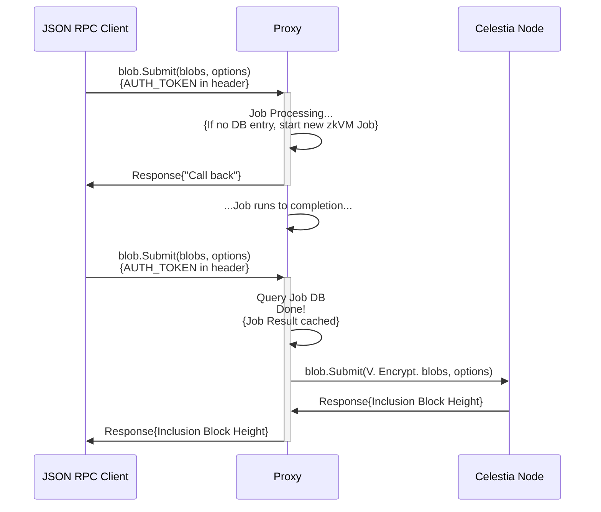
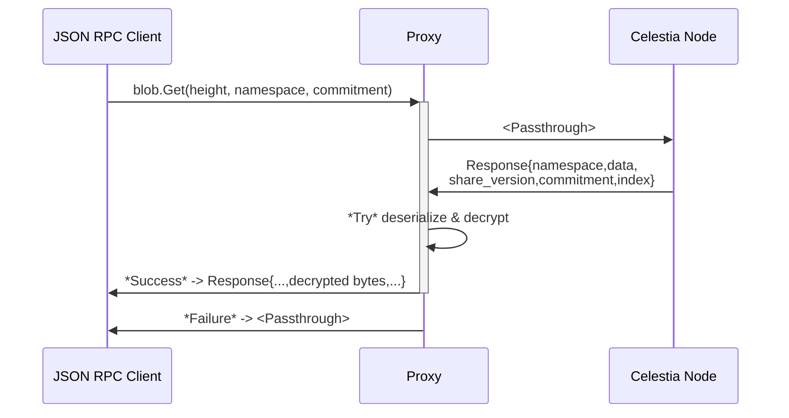

# About private blockspace

The foundation of the internet's financial infrastructure is shifting. For the first decade of blockchain development, transparency was the defining feature. Every transaction, balance, and state change was visible to anyone. That openness enabled auditability, but also prevented adoption by institutions that must protect sensitive data. 

**Private blockspace** changes that. Built on Celestia’s modular data availability layer, private blockspace introduces a new way to publish encrypted data that remains confidential while still being verifiable and retrievable. This unlocks a crucial missing capability for onchain finance: **confidentiality with compliance**. 

At a high level, private blockspace adds an encryption and proof layer that sits between client applications and Celestia’s data availability network. This layer is implemented as the private blockspace proxy, a lightweight service that encrypts, proves, and routes data without modifying the underlying Celestia protocol. In the sections that follow, we’ll look at how the proxy handles blob submission and retrieval.

## Submitting a blob

The private blockspace proxy acts as a intermediary between your JSON-RPC client and the Celestia network. When you submit a blob, the proxy first encrypts the data and then generates a proof inside a zkVM. Then, it records the result in a local database and returns an acknowledgment while processing continues in the background. Once the proof completes, the result is cached so identical submissions can immediately return the inclusion block height. From the client’s perspective, posting encrypted data feels like a single RPC call, even though behind the scenes, the proxy is handling encryption, verification, and coordination with Celestia.

## Retrieving a blob

When retrieving a blob, the Proxy acts as a transparent relay between the client and the Celestia network. The proxy forwards the `blob.Get` request to the Celestia network, receives the raw blob data, and then attempts to deserialize and decrypt it using the configured encryption key. If the blob was encrypted through the proxy, decryption succeeds and the proxy returns the original plaintext data. If it was not, the proxy simply passes the response through unchanged. This design ensures compatibility with both encrypted and unencrypted blobs, so existing clients can retrieve data without modification.

## Verifiable encryption

Developers can use verifiable encryption to prove facts about encrypted data without revealing the actual data. When a blob is encrypted through the proxy, the proxy can generate a proof inside a zkVM showing that the ciphertext was produced correctly and that the underlying plaintext satisfies certain conditions, such as containing a valid Merkle root or state commitment.

This gives builders a new way to design applications that remain private yet provably correct. Anyone can verify that an encrypted blob is well-formed and available on Celestia, anyone can prove certain facts about the data, however only authorized parties can decrypt it. **The result is a foundation for financial applications that preserve confidentiality without giving up verifiability**.

## Use cases

**Confidential exchanges** 

Decentralized exchanges like [Hibachi](https://hibachi.xyz/) use private blockspace to keep order book and balance data private while still proving data availability and correctness. This allows traders to operate privately and safely, with public assurances of solvency and liveness. 

**Confidential payments** 

Institutions can use private blockspace to run stablecoin or interbank payment networks that settle onchain. Payment details remain encrypted by default, but auditors and regulators can verify proofs of correctness and availability. 

**Tokenization of real-world assets** 

Builders can use private blockspace to tokenize deposits, treasuries, or invoices while keeping holder identities and positions private. The system provides verifiable assurance that the tokenized state exists and is recoverable. 

**Private backups and recovery** 

Protocols can use private blockspace for encrypted, verifiable backups of critical state data. If operators fail, users can recover from the last published snapshot without exposing any plaintext. 

**Cross-chain messaging and data markets** 

Private blockspace can also serve as a verifiable transport layer for encrypted messages between blockchains or as the foundation for privacy-preserving data marketplaces. 

## References and further reading

- [PDA Proxy Repo on GitHub](https://github.com/celestiaorg/pda-proxy)
- [Verifiable Encryption Overview Talk – May 2025](https://www.youtube.com/watch?v=6P7yWZ4Cshs) 
- [VE Slides – HackMD](https://hackmd.io/@Nuke/SyHBUsdWlg) 
- [Celestia Docs: Data Availability and Retrievability](https://docs.celestia.org/learn/retrievability) 
- [Forum Post: User-Centric Private Data Availability](https://forum.celestia.org/t/account-user-centric-private-data-avalibility/2155) 
- [Research: Verifiable encryption & private blockspace proxy service](https://github.com/nuke-web3/noir-verifiable-chacha)
