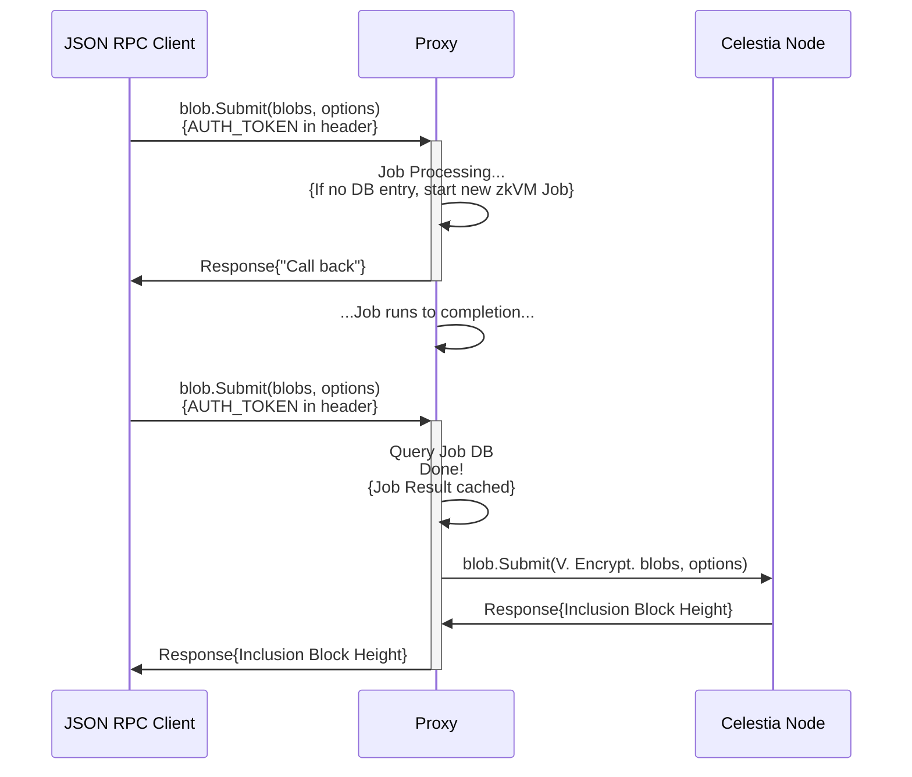
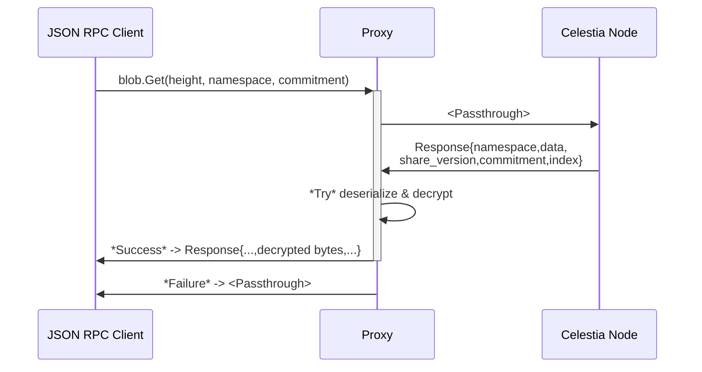

# About Private Blockspace

The highest-stakes onchain markets—including perpetual exchanges, order books, and institutional rails—depend on information that cannot be public. Positions, balances, liquidations, and routing logic are inherently sensitive. Yet pushing that data offchain reintroduces trusted operators and weakens the core promise of being onchain: **independent auditing, verifiability, and safe exits when it matters most.**

**Private Blockspace** is Celestia’s approach to solving this problem: keep sensitive state **confidential**, while still making it **publicly accountable**.

Private Blockspace enables networks to publish **encrypted state to Celestia**, allowing anyone to verify data availability and protocol commitments **without revealing the underlying contents**. The result is **private systems with public verifiability guarantees**—fault-resistant, auditable, and designed to support safe exit mechanisms.

At a high level, Private Blockspace adds an encryption + proof layer between your application and Celestia’s data availability layer. This layer is implemented as the **Private Blockspace Proxy**: a lightweight service that encrypts, proves, and routes data **without modifying existing Celestia integrations**.

## Submitting a blob

The Private Blockspace Proxy acts as an intermediary between your JSON-RPC client and the Celestia network.

When you submit a blob:

1. The proxy encrypts the data.
2. The proxy generates a proof inside a zkVM attesting to correct encryption and any configured “anchors” about the plaintext.
3. The proxy stores the job result in a local database and returns an acknowledgement while processing continues.
4. Once the proof completes, the result is cached so identical submissions can return immediately.
5. The proxy submits the verifiably encrypted blob to Celestia via `blob.Submit`.

From the client’s perspective, posting encrypted data feels like a single RPC call, while the proxy handles encryption, verifiability, and coordination with Celestia behind the scenes.

## Retrieving a blob

When retrieving a blob, the proxy behaves as a transparent relay:

1. The client calls `blob.Get(height, namespace, commitment)`.
2. The proxy forwards the request to a Celestia node.
3. The proxy receives the raw blob response.
4. The proxy attempts to deserialize and decrypt using the configured encryption key.

If the blob was encrypted through the proxy, decryption succeeds and the proxy returns the original plaintext bytes. If it was not, the proxy passes the response through unchanged.

This ensures compatibility with both encrypted and unencrypted blobs, so existing clients can adopt Private Blockspace incrementally.

## Verifiable Encryption (VE)

With normal encryption, ciphertext should be indistinguishable from random noise. That property is what keeps data private—but it also makes it difficult to prove _anything_ about encrypted data without decrypting it.

Private Blockspace uses **Verifiable Encryption (VE)** to bridge this gap.

VE enables proofs of _select properties_ of fully encrypted data **without decryption**. For example, a system can prove statements like:

- “This encrypted blob contains a Merkle proof whose root is `0xabc123…`”
- “This ciphertext was produced using the expected algorithm, key format, and nonce rules”
- “The plaintext hashes to a specific commitment”

This is accomplished by running encryption inside a zkVM, producing a proof that encryption was executed correctly while also exposing application-defined “anchors” (such as hashes or commitment checks) that remain safe to reveal.

**Outcome:** anyone can verify availability and correctness constraints, while only authorized parties can decrypt the underlying contents.

## Key exchange and management strategies

A critical design question in Private Blockspace is key management:

> If keys are withheld, then the data is effectively withheld.

Private Blockspace is designed to support different key exchange and reconstruction strategies depending on your application requirements and threat model.

### Account-centric model

A proposed account-centric model enforces that **all account state is published and available**, while also being encrypted such that only the intended party (or parties) can decrypt.

Key properties of this approach:

- **User-defined encryption keys:** users define keys for encrypting their own account state, ensuring they can always decrypt their data and enabling forward secrecy.
- **Conditional selective disclosure:** users can allow decryption by specific parties using standard public key cryptography, key exchange protocols, and/or threshold schemes.
- **User-initiated protocol progression:** applications can allow users to progress the protocol themselves by proving correct state transitions onchain, enabling “forced” state updates such as withdrawals.

This model is designed to support systems that remain private during normal operation, while still enabling safe exits and recovery paths under application-defined conditions.

## Use cases

Private Blockspace is designed for applications where **privacy is required**, but **public accountability cannot be sacrificed**.

### Accountable offchain exchanges

Operators of offchain or hybrid exchanges can keep internal state private while still being required (by protocol design) to prove state availability and commitments publicly.

This improves fault tolerance and auditability without forcing users to trust an opaque operator for safe exits.

**In production: Hibachi**

Hibachi is the first independent deployment using Private Blockspace for a fast perps exchange. Hibachi publishes verifiably encrypted exchange state to Celestia, keeping balances and positions private while making data availability and correctness publicly verifiable.

### Trust-minimized data marketplaces

Private Blockspace can also support trust-minimized private data markets:

- sellers publish verifiably encrypted data to Celestia
- buyers verify availability and integrity before payment—without seeing the plaintext
- payment is enforced only once availability is proven

This shifts trust away from intermediaries and toward verification, producing private exchange workflows that are auditable and fault-resistant by design.

## References and further reading

- [Private Blockspace Proxy repo on GitHub](https://github.com/celestiaorg/private-blockspace-proxy/)
- [Verifiable Encryption (VE) in depth](https://github.com/celestiaorg/private-blockspace-proxy/blob/main/doc/verifiable_encryption.md)
- [Forum post: Account-centric model](https://forum.celestia.org/t/account-user-centric-private-blockspace/2155)