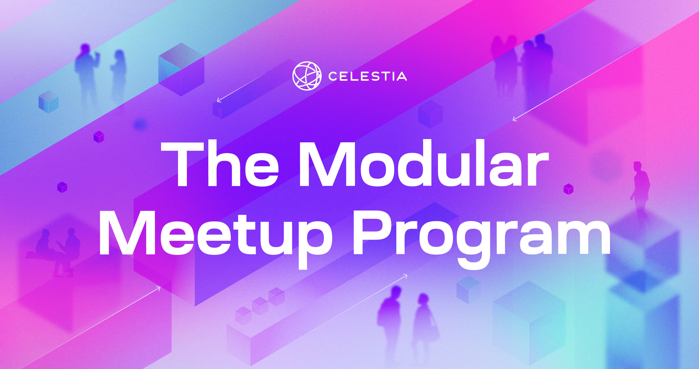

# Celestia Modular Meetup Program

Welcome to the ultimate guide for Modular Meetup organizers!
This collection of resources is designed for those enthusiastic
about fostering grassroots Modular Meetups with support from
Celestia around the world.

## Program description

The Celestia Modular Meetup Program aims to empower meetup
organizers, providing education and support, and encouraging
collaboration within the Web3 ecosystem. This rapidly growing
community has already achieved incredible success with the
first Modular Meetup in Lisbon, and will grow from there.

Join fellow enthusiasts, engage in enlightening discussions,
and make the most of the insightful resources provided. These
resources are designed to serve as a go-to playbook for meetup
organizers, especially when starting your journey.

## Important info

### Celestia.org Community Code of Conduct

The purpose of our Community Code of Conduct is to foster an
inclusive, welcoming, and supportive environment for everyone
participating in Celestia community events. We're all here to
learn from each other, expand our skillsets, and enjoy a positive
experience together.

All meetup attendees, speakers, sponsors, and volunteers, including
the event organizing team, are kindly asked to adhere to the following
Code of Conduct. Organizers will respectfully enforce this code
throughout the event. We genuinely appreciate the cooperation of all
participants in maintaining a safe and empowering space for everyone.

- [Celestia.org Community Code of Conduct](https://docs.celestia.org/community/coc/)

### Emails

As a participant in the Celestia Modular Meetup Program, you
can expect to receive the following emails:

1. Welcome email with links to calendar events and Discord channel
2. Monthly Catch-up call invites
3. Recap emails with notes from calls

### Discord

Your active participation is key to unlocking the full potential
of this vibrant community. Our primary communication tool is Discord,
providing an engaging platform to connect with fellow organizers:

- [Discord link](https://discord.com/invite/je7UVpDuDu)

Make sure to join the channel #meetups where we will be also giving
you the relevant role as a Meetup Organizer.

## Materials

As a meetup organizer, you'll gain access to the Celestia Modular Meetup
Program's list of resources. This collection should become your trusted
companion in organizing events. Drawing upon the wisdom of seasoned event
organizers, this resource is available for you and your co-organizers
to explore and learn.

- [Modular Meetup Toolkit](./modular-meetup-toolkit.md)
- [Speaker List](./speaker-list.md)
- [Meetup Guide](./modular-meetup-guide.md)

## Signup form

In order to be added to the Modular Meetup Organizer call, please
complete the following form:

- [Signup Form](https://celestia-intake.typeform.com/to/zNI5W4uI).

We will then send you an email and add you to next upcoming Modular
Meetup Organizer call. Please keep in mind, this program is meant
for serious meetup organizers who want to build their local community
for the modular ecosystem.
