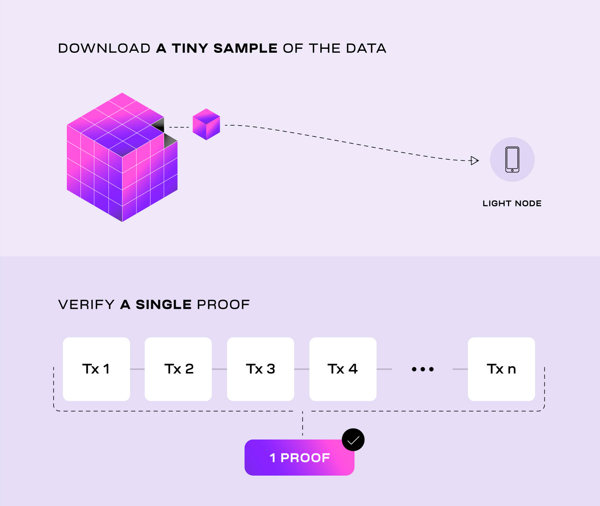

# Build modular

“I’m a developer, and I want to know what the benefits of modular blockchains
are for me!”

You’ve come to the right place. This page will give you the rundown on modular
blockchains and their benefits for developers like you.

If you already know all this, [skip to the end](https://docs.celestia.org/developers/build-modular/#building-on-celestia)
to get straight into building.

## What is a modular blockchain?

With blockchains there are more or less four core functions that they do.

- **Execution**: transaction execution and state update.
- **Settlement**: finality and dispute resolution.
- **Consensus**: agreement on transaction ordering.
- **Data availability**: prove data was published to the network.

Modular blockchains specialize in one or two of these functions rather
than doing all of them like a monolithic blockchain. You probably know
about layer 1s and layer 2s. That’s the general idea.

A typical example of a modular blockchain you might’ve heard of is a
rollup. Rollups host smart contracts and execute transactions, much like
any monolithic chain. But, the data of those transactions get sent to a
layer 1 blockchain to carry out the remaining functions.

If you want to brush up on your understanding of modular blockchains,
head over to [Learn Modular](https://celestia.org/learn/).

## Ease of deploying a chain

One of the goals of modular blockchains is to make it as easy to deploy
a blockchain as a smart contract. There are a few unique ways that
modular blockchains can significantly reduce the cost of deploying a
new blockchain.

1. **No validator set is required**. Rollups can deploy without sourcing
   their own set of validators or sequencers.
2. **Inherit security from the start**. Rollups don’t need to build all
   their security from scratch.
3. **Any part of the stack can be delegated**. Development time can be
   reduced by outsourcing functions of the rollup to external providers.

All in all, builders will be able to outsource as much of the stackas
they need. Deploying a new blockchain will be as simple as clicking a
few options to initialize a production-ready rollup.

## Scaling

Of course, a much higher scale is necessary if we want to support
many more users. And modular blockchains use some new innovative
technologies that can help us get there.

- [Data availability sampling](https://celestia.org/glossary/data-availability-sampling/)
  enables modular blockchains like Celestia to scale data availability with the
  number of light nodes - that means more capacity for rollups.
- **Fraud and validity proofs** make rollups vastly more efficient
  to verify. Nodes only need to verify a small proof of transaction
  validity ([validity proof](https://celestia.org/glossary/validity-proof/))
  or assume transactions are valid by default
  ([fraud proof](https://celestia.org/glossary/state-transition-fraud-proof/)).
  This means rollups don’t require every node in the network to re-execute
  every transaction.

- **Decoupling execution from consensus** lets developers define the VM
  that best fits the scaling needs of their application.
- **Separating applications** across multiple rollups isolates congestion.
  If an application congests the execution capacity of one rollup, all
  other rollups remain unaffected in their execution capacity.

All these scaling properties combined make new types of applications
and features possible, like onchain gaming, dynamic metadata, and
ephemeral rollups, to name a few.

## Customizability

By design, modular blockchains don’t lock in any feature set.
They promote experimentation and customization.

Remember how decoupling execution from consensus enables VM
customizability? Well, rollups are the execution component. Applications
can run on their own rollup and adjust the VM to maximize their
application's performance. Developers have that flexibility because
Celestia's execution logic doesn't restrict rollups.

Basically, rollups can be customized to integrate any new or existing
VM stack.

With existing rollup frameworks, developers can run rollup testnets
using the EVM or Cosmos SDK. In the future, one can imagine a variety
of VMs that rollup frameworks support, providing developers with more
out-of-the-box options for their applications.

Some customizations that could be made to a rollup's VM include
custom precompiles, changing transaction processing from sequential
to parallel, or adding support for private smart contracts.

All of this only scratches the surface.

## Building on Celestia

So, you’re ready to start experimenting and building on Celestia?
Here are a few options that are currently available for developers.

### Smart contracts

[Bubs testnet](https://bubstestnet.com/) is a dedicated EVM-compatible
rollup that developerscan use to test and deploy smart contract
applications.

### Sovereign rollups

Developers can build applications on a sovereign rollup testnet
on Celestia. [Rollkit](https://rollkit.dev/) and
[Sovereign SDK](https://github.com/Sovereign-Labs/sovereign-sdk/tree/main/examples/demo-rollup)
provide frameworks for deploying sovereign rollup testnets
on Celestia.

### Rollups

Developers can also build rollup testnets for their applications
using [Dymension’s Rollapps](https://docs.dymension.xyz/) or
[Optimism’s OP Stack](https://docs.celestia.org/developers/optimism-devnet/).
