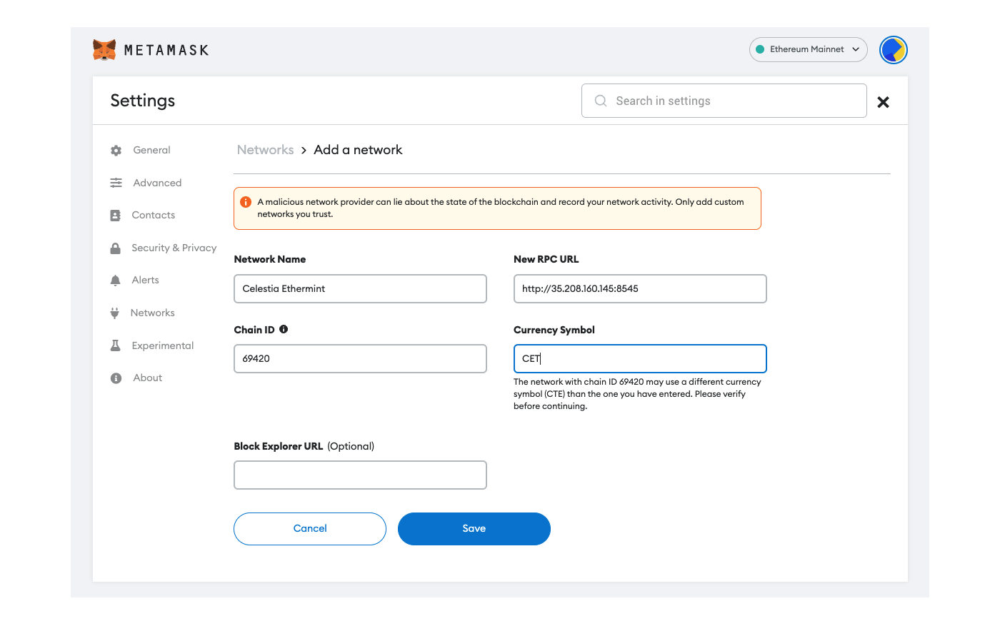

# Connecting Metamask to Optimism

In this guide you'll connect your wallet to the Celestia Optimism fork RPC Node.

## Prerequisites

If you do not have [MetaMask](https://metamask.io/) installed, please install it
[here](https://metamask.io/download/)

## Configuring the network details

First, open the MetaMask settings and choose "Add Network"

Next, enter the settings as follows:

__Network name__: Optimism on Celestia

__RPC URL__: `http://35.208.160.145:8545`

__Chain ID__: 69420

__Currency__: OPC

__Explorer__: leave blank

Click __Save__.
