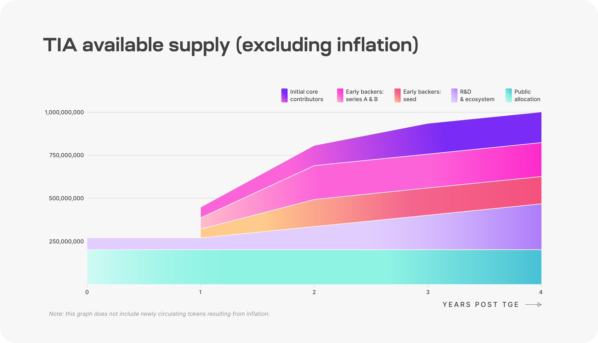

# Staking, governance, & supply

## Proof-of-stake on Celestia
<!-- markdownlint-disable MD013 -->
<!-- markdownlint-disable MD033 -->
Celestia is a proof-of-stake blockchain based on CometBFT and the Cosmos SDK.
Celestia supports in-protocol delegation and will start with an initial
validator set of 100.

Staking TIA as a validator or delegator enables you to earn staking rewards from
the network. Validators charge a fee to delegators which gives them a percentage
of staking rewards.

Learn
[how proof of stake works on Cosmos SDK chains like Celestia](https://docs.cosmos.network/main/modules/staking).

| Consensus mechanism | Proof-of-stake |
| -------- | ------- |
| Blockchain framework | Cosmos SDK |
| Validator set size | 100 |
| Delegation support | Yes |

Learn how to
[stake on your own at the community dashboards](../../developers/staking/).

## Inflation

TIA inflation starts at 8% annually and decreases by 10% every year until it
reaches the long term issuance rate of 1.5%. Exact annual inflation rates can be
found in the diagram below.

The annual provisions for inflation are calculated based on the total supply of
TIA at the beginning of each year. To calculate how many TIA to issue per block,
Celestia uses the block timestamp rather than the block height since the time
between blocks can vary and cause actual issuance to be higher than the target.

For an in-depth understanding, refer to
[ADR019](https://github.com/celestiaorg/celestia-app/blob/main/docs/architecture/adr-019-strict-inflation-schedule.md).

## Decentralised governance

### Network parameters

TIA holders (not just stakers) can propose and vote on governance proposals to
change a subset of network parameters. To learn more, see a
[complete list of both the changeable and non-changeable parameters and their values](https://github.com/celestiaorg/celestia-app/blob/v1.x/specs/src/specs/params.md).
Additionally, learn how to
[submit and vote on governance proposals](../../nodes/celestia-app-commands/#governance).

### Community pool

Starting at genesis, Celestia’s
[community pool](https://docs.cosmos.network/main/modules/distribution)
receives 2% of all Celestia block rewards. TIA stakers may vote to fund
ecosystem initiatives as in many other Cosmos SDK chains.

Learn how to
[submit a governance proposal to spend community pool funds](../../nodes/celestia-app-commands/#community-pool)
.

## TIA allocation at genesis

Celestia will have a total supply of 1,000,000,000 TIA at genesis,
split across five categories described in the chart and table below.

| Category | Description | % |
| -------- | ----------- | -------------- |
| Public Allocation | Genesis Drop and Incentivized Testnet: 7.4% Future initiatives: 12.6% | 20% |
| R&D & Ecosystem | Tokens allocated to the Celestia Foundation and core devs for research, development, and ecosystem initiatives including: - Protocol maintenance and development - Programs for rollup developers, infrastructure, and node operators | 26.8% |
| Early Backers: Series A&B | Early supporters of Celestia | 19.7% |
| Early Backers: Seed | Early supporters of Celestia | 15.9% |
| Initial Core Contributors | Members of Celestia Labs, the first core contributor to Celestia | 17.6% |

### Unlocks

Celestia’s 1 billion TIA supply at genesis will be subject to several different
unlock schedules. All tokens, locked or unlocked, may be staked, but staking
rewards are unlocked upon receipt.

**Circulating supply** is defined as the amount of TIA tokens in general
circulation without onchain transfer restrictions.

**Available supply** is defined as the amount of TIA tokens that are either part
of the circulating supply or are unlocked but subject to some form of governance
to determine when the tokens are allocated. This includes the unlocked portion
of the R&D & Ecosystem tokens and the tokens set aside for future initiatives.

_The definitions for circulating and available supply were adapted from
[Optimism’s definitions](https://community.optimism.io/docs/governance/allocations/#token-distribution-details)._

Unlock schedule by category is described in the table below.

| Category | Unlock Schedule |
| -------- | --------------- |
| Public Allocation | Fully unlocked at launch. |
| R&D & Ecosystem | 25% unlocked at launch. Remaining 75% unlocks continuously from year 1 to year 4. |
| Initial Core Contributors | 33% unlocked at year 1. Remaining 67% unlocks continuously from year 1 to year 3. |
| Early Backers: Seed | 33% unlocked at year 1. Remaining 67% unlocks continuously from year 1 to year 2. |
| Early Backers: Series A&B | 33% unlocked at year 1. Remaining 67% unlocks continuously from year 1 to year 2. |
