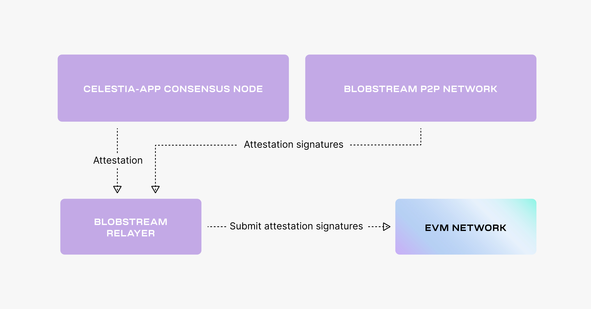

# Blobstream

The Blobstream, covered previously in
[the Celestia blog post](https://blog.celestia.org/celestiums/),
introduces the concept of a rollup, which is an EVM L2
rollup that uses Celestia for data availability
but settles on Ethereum (or any other EVM L1 chain).

This page and following tutorials will go over the Quantum Gravity
Bridge and how Validators on Celestia can run it.

If you're looking to learn more, you can view
[the `orchestrator-relayer` repository](https://github.com/celestiaorg/orchestrator-relayer)
, and
[read more about the Blobstream](https://github.com/celestiaorg/quantum-gravity-bridge#how-it-works).

## Overview

The Blobstream,
consists of two components: an [Orchestrator](../blobstream-orchestrator)
and a [Relayer](../blobstream-relayer).

In the following diagram, we show how a celestium would post the data to
Celestia. This will later be attested to by the Celestia validator set, and
eventually posted to the target EVM chain (in this case, Ethereum). Then,
the celestium, or any party, will be able to verify the attestations, i.e. valsets
and data commitments, directly on the EVM chain on the Blobstream smart contract. You can
reference
[the Blobstream smart contract](https://github.com/celestiaorg/quantum-gravity-bridge/blob/master/src/QuantumGravityBridge.sol).

The specification of the Blobstream `Valset`s, which track the Celestia validator set
changes, can be found in [ADR 002](https://github.com/celestiaorg/celestia-app/blob/main/docs/architecture/adr-002-qgb-valset.md).

The Blobstream data commitments, which represent commitments over sets of blocks
defined by a data commitment window, are
discussed more in-depth in
[ADR 003](https://github.com/celestiaorg/celestia-app/blob/main/docs/architecture/adr-003-qgb-data-commitments.md).

The Orchestrator is part of the validator setup and works as follows:

- Celestia App: creates an attestation on the state machine level that needs to
  be signed
- The Orchestrator: queries the attestation, signs it, then submits the signature
  back to Celestia App

The diagram below goes over this process.

The Relayer deploys the Blobstream smart contract first to the EVM L1 chain (if it is
not deployed before), and then relays the attestations from Celestia App to the
EVM L1 Chain.

The diagram below goes over this process.

You can learn more about the mechanics behind the Relayer in
[ADR 004](https://github.com/celestiaorg/celestia-app/blob/main/docs/architecture/adr-004-qgb-relayer-security.md).

## Setting up the Blobstream

The following sections in this category presume you have the following setup:

- A Celestia App
[validator node](../consensus-node#optional-setting-up-a-validator) running
- A Celestia Node [bridge node](../bridge-node) running

## Next steps

1. [Install the binary](../blobstream-binary)
2. [Blobstream Orchestrator](../blobstream-orchestrator)
3. [Key management](../blobstream-keys)
4. [Blobstream Relayer](../blobstream-relayer)
5. [Deploy the Blobstream contract](../blobstream-deploy)
