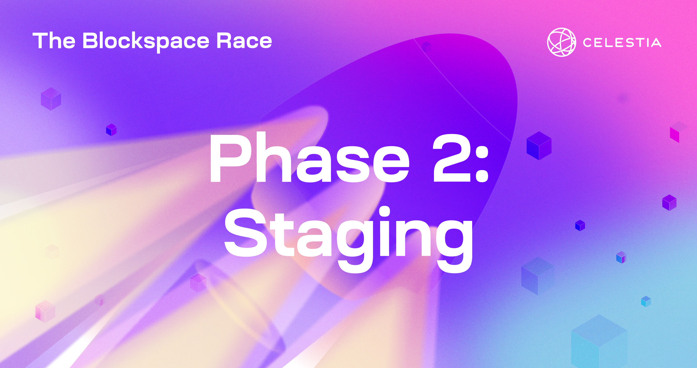
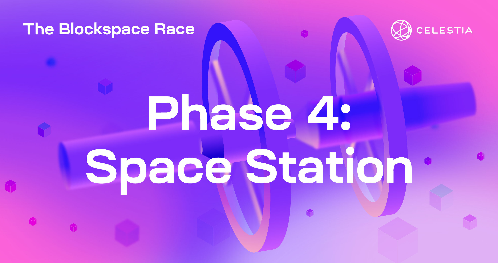
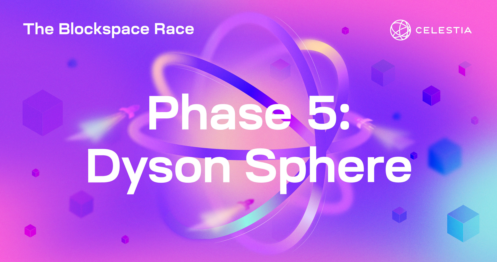

# The Blockspace Race

import BsrVersionTags from "@site/src/components/BsrVersionTags";
import blockspaceraceVersions from "../constants/blockspacerace_versions.js";
import constants from "../constants/constants.js";


## Overview

Celestia is the first modular blockchain network. Its mission is
to make deploying a blockchain as easy as deploying a new smart
contract. Celestia introduces what is called the data availability
layer for enabling efficient scaling and allowing L2 rollups to
do data sampling for transactions they need.

The Blockspace Race will help put the Celestia network through its
paces to harden features and prepare node operators for mainnet launch.
Learn more about the design of the program and its importance for the
Celestia community at our announcement post [here](https://blog.celestia.org/the-blockspace-race/).

Since Celestia is made up of two networks (consensus and data
availability), the incentivized testnet consists of multiple node types.

### Consensus network

- Validator node: Orders transactions in the block and participate
  in consensus.
- Full consensus nodes: Syncs the chain history but does not sign
  the transaction block.

### Data availability network

- Bridge node: Bridges blocks between the data availability network
  and the consensus network.
- Light node: Conducts data availability sampling on the data
  availability network.
- Full storage node: Stores all the data but does not connect to
  the consensus network.

Participants have been selected to run a node type from the above
list, with a limit of one node per participant. The Blockspace Race
will consist of five phases. Each phase will have different tasks
depending on which node type participant will operate. Points are earned
by completing these tasks, with additional bonus tasks that the team
will evaluate at their sole discretion.

The Celestia Labs team will provide all information, support,
announcements and updates on [Discord](https://discord.com/invite/YsnTPcSfWQ)
and [official website](https://celestia.org). We also encourage
participants to familiarise themselves with the [Supplemental Incentivized
Testnet Terms](https://docs.celestia.org/community/itn-tos/), which
govern participation in the program.

> **NOTE**: Node operator tasks will include three data availability node subtypes:
> Bridge Nodes, Full Storage Nodes and Light Nodes. If you have been selected
> to run one of the three data availability node subtypes, please make sure
> to only perform the tasks corresponding to your node type. You will only
> receive points for completed tasks corresponding to your node types.
> If there is no indication that a node operator task is specific to any
> of the three subtypes (such as the Bonus tasks), you are eligible for
> that task also.

### Getting started

- All participants should join [Celestia Discord](https://discord.gg/celestiacommunity).
- All participants will receive access to their profile on [Knack portal](https://www.knack.com/).
  Wait for an email for further instructions on profile setup.
- Participants will be granted appropriate tags on Discord based on the
  node type they were selected for.
- Setup guides, timelines, and other relevant information is posted within the phases.

### Security policy

In the interest of reporting security issues and vulnerabilities, please
refer to our Security Policy found [here](https://blog.celestia.org/the-blockspace-race/).

### Points and rewards

Celestia is allocating 15,000,000.00 TIA tokens in rewards for
participants of the Blockspace Race. Points earned during the event
will be converted into TIA tokens after the event ends.

Please note that the points you receive for participating and
completing the incentivized testnet program will be available to
claim once the Celestia mainnet launches. Eligibility requirements
and restrictions related to points and tokens are described in
the [Supplemental Incentivized Testnet Terms](https://docs.celestia.org/community/itn-tos/).

### Participation rules

As a participant in the incentivized testnet program, you must observe the following
participation rules:

- Abuse of the incentivized testnet faucet or other violations of
  the [Supplemental Incentivized Testnet Terms](https://docs.celestia.org/community/itn-tos/)
  are punishable by removal from the incentivized testnet program.
  **Your balance or usage of testnet faucet tokens will not translate
  into any points or mainnet tokens**.
- Validators are required to also run bridge nodes but cannot gain
  points for running both
- Please ensure you submit your own work (Node ID, tx hashes, etc).
  Submitting another participant’s work will result in immediate removal
  from the incentivized testnet. We will be monitoring it and have security
  checks in place.

### Software version numbers

Here we list the relevant version numbers for the software packages and libraries
that will be used in the incentivized testnet:

<BsrVersionTags bsrVersions={blockspaceraceVersions} constants={constants} />

### Participation by node count

#### Consensus participants

- 100 validator nodes

#### Data availability participants

- 740 light nodes
- 50 bridge nodes
- 50 full storage nodes

#### RPC endpoints

The RPC endpoint is to allow users to interact with Celestia's nodes by
querying the node's state and broadcasting transactions on the
Celestia network. The default port is 26657.

We will be listing RPC endpoints
provided by the community here and their status provided by Brightly Stake
[here](https://celestia-tools.brightlystake.com/).

<details>
<summary>View all RPC endpoints</summary>
<br/>

- `rpc-blockspacerace.pops.one`
- `rpc-1.celestia.nodes.guru`
- `rpc-2.celestia.nodes.guru`
- `celestia-testnet.rpc.kjnodes.com`
- `celestia.rpc.waynewayner.de`
- `rpc-blockspacerace.mzonder.com`
- `rpc-t.celestia.nodestake.top`
- `rpc-blockspacerace.ryabina.io`
- `celest-archive.rpc.theamsolutions.info`
- `blockspacerace-rpc.chainode.tech`
- `rpc-blockspacerace.suntzu.pro`
- `public.celestia.w3hitchhiker.com`
- `rpc.celestia.stakewith.us`
- `celestia-rpc.validatrium.club`
- `celrace-rpc.easy2stake.com`
- `rpc.celestia.blockscope.net`
- `rpc-celestia-testnet-blockspacerace.keplr.app`
- `celestiarpc.bloclick.com:26657`
- `celestia-testnet-rpc.swiss-staking.ch`
- `rpc-blockspacerace.moonli.me`
- `rpc-celestia.gpvalidator.com:26657`
- `rpc-celestia.activenodes.io`
- `rpc-testnet.celestia.forbole.com`
- `209.126.86.119:26657`
- `37.27.2.226:26657`
- `rpc-celestia.lowfeevalidation.com`
- `cel-cre.crescent.network:26657`
- `65.109.112.178:35657`
- `rpc.testnet.celestia.citizencosmos.space`
- `celestia-rpc.spidey.services`
- `129.213.43.128:26657`
- `rpc.blockspace-race.celestia.counterpoint.software`
- `tm.celestia.testnet.injective.network`
- `celestia.cumulo.org.es:443`
- `3.145.65.141:26657`
- `celestia-rpc.stakin-nodes.com`
- `rpc.blockspacerace.celestia.dsrvlabs.dev:17003`
- `celestia-blockspacerace-rpc.brocha.in`
- `rpc-celestia-itn.cosmostation.io`
- `celestia.rpc.nodersteam.com:14657`
- `rpc-blockspacerace.staking.production.figment.io`
- `blockspacerace-0.larry.coffee:26657`
- `celestia-rpc.0xcryptovestor.com`
- `rpc.celestia.contributiondao.com`
- `rpc.test.fcstech.de`
- `celestia.blockspacerace0.stakingcabin.com:26657`
- `rpc-tn.celestia.0xfury.io`
- `rpc.celestia.validatus.com`
- `celestia-blockspacerace.brightlystake.com`
- `blockspacerace-rpc.upnodedev.xyz`
- `rpc-celestia2-testnet.imperator.co`
- `rpc.blockspacerace-0.celestia.aviaone.com`
- `celestia-itn.staking4all.org:26657`
- `celestia-testnet-rpc.nodeguardians.io`
- `rpc-blockspacerace.staker.space`
- `rpc-blockspacerace.freshstaking.com:52657`
- `bd-celestia-rpc-node-01.stg.bdnodes.net/tendermint_rpc`
- `bd-celestia-rpc-node-02.stg.bdnodes.net/tendermint_rpc`
- `rpc-blockspacerace.avril14th.org:26657`
- `celestia-blockspacerace.01no.de:26657`
- `rpc.celestia.maplenodes.com`
- `rpc.celestia-testnet.tm.p2p.world`
- `celestia-spacerace-rpc01.stakingwizard.com:26657`
- `rpc01.blockspacerace-0.celestia.zkvalidator.com:26657`
- `celestia-bsr-rpc.qubelabs.io`
- `rpc-celestia.notional.ventures`
- `31.220.87.152:26657`
- `celestia.blockspace.rpc.neuler.xyz:26657`
- `rpc-celestia.alphab.one`

</details>

##### Websocket endpoints

The websocket endpoint is to allow users to interact with a Celestia Node using
websockets, a modern open-source and high-performance websocket framework. The default
port is 26657.

<details>
<summary>View all websocket endpoints</summary>
<br/>

- [wss://bd-celestia-rpc-node-01.stg.bdnodes.net/websocket/](wss://bd-celestia-rpc-node-01.stg.bdnodes.net/websocket/)
- [wss://bd-celestia-rpc-node-02.stg.bdnodes.net/websocket/](wss://bd-celestia-rpc-node-02.stg.bdnodes.net/websocket/)
- [wss://ws-celestia.notional.ventures/](wss://ws-celestia.notional.ventures/)

</details>

#### gRPC endpoints

The gRPC endpoint is to allow users to interact with a Celestia Node using
gRPC, a modern open-source and high-performance RPC framework. The default
port is 9090. In the Cosmos SDK, gRPC is used to define state queries and
broadcast transactions.

<details>
<summary>View all gRPC endpoints</summary>
<br/>

- [https://grpc-blockspacerace.pops.one/](https://grpc-blockspacerace.pops.one/)
- [http://rpc-1.celestia.nodes.guru:10790/](http://rpc-1.celestia.nodes.guru:10790/)
- [http://rpc-2.celestia.nodes.guru:10790/](http://rpc-2.celestia.nodes.guru:10790/)
- [https://celestia-testnet.grpc.kjnodes.com/](https://celestia-testnet.grpc.kjnodes.com/)
- [https://celestia.waynewayner.de/grpc/](https://celestia.waynewayner.de/grpc/)
- [https://grpc-blockspacerace.mzonder.com:443/](https://grpc-blockspacerace.mzonder.com:443/)
- [https://grpc-t.celestia.nodestake.top/](https://grpc-t.celestia.nodestake.top/)
- [https://grpc-blockspacerace.ryabina.io:9090/](https://grpc-blockspacerace.ryabina.io:9090)
- [https://celest-archive.grpc.theamsolutions.info:9090/](https://celest-archive.grpc.theamsolutions.info:9090/)
- [https://blockspacerace-grpc.chainode.tech/](https://blockspacerace-grpc.chainode.tech/)
- [https://grpc-blockspacerace.suntzu.pro:9090/](https://grpc-blockspacerace.suntzu.pro:9090/)
- [http://public.celestia.w3hitchhiker.com/](http://public.celestia.w3hitchhiker.com/)
- [https://grpc.celestia.stakewith.us/](https://grpc.celestia.stakewith.us/)
- [https://celrace-grpc.easy2stake.com/](https://celrace-grpc.easy2stake.com/)
- [http://rpc.celestia.blockscope.net:9191/](http://rpc.celestia.blockscope.net:9191/)
- [https://grpc-celestia-testnet-blockspacerace.keplr.app/](https://grpc-celestia-testnet-blockspacerace.keplr.app/)
- [http://celestiarpc.bloclick.com:9090/](http://celestiarpc.bloclick.com:9090/)
- [http://celestia-testnet-grpc.swiss-staking.ch:10690/](http://celestia-testnet-grpc.swiss-staking.ch:10690/)
- [http://rpc-celestia.gpvalidator.com:9090/](https://rpc-celestia.gpvalidator.com:9090/)
- [http://rpc-celestia.lowfeevalidation.com:9090/](http://rpc-celestia.lowfeevalidation.com:9090/)
- [https://cel-cre.crescent.network:9090/](https://cel-cre.crescent.network:9090/)
- [https://celestia-grpc.validatrium.club/](https://celestia-grpc.validatrium.club/)
- [https://celestia-grpc.spidey.services/](https://celestia-grpc.spidey.services/)
- [http://grpc.blockspace-race.celestia.counterpoint.software:9090/](http://grpc.blockspace-race.celestia.counterpoint.software:9090/)
- [https://grpc.celestia.testnet.injective.network/](https://grpc.celestia.testnet.injective.network/)
- [https://cumulo.org.es/celestia.grpc/](https://cumulo.org.es/celestia.grpc/)
- [https://celestia.grpc.cumulo.org.es:443/](https://celestia.grpc.cumulo.org.es:443/)
- [https://celestia-grpc.stakin-nodes.com/](https://celestia-grpc.stakin-nodes.com/)
- [http://rpc.blockspacerace.celestia.dsrvlabs.dev:17008/](http://rpc.blockspacerace.celestia.dsrvlabs.dev:17008/)
- [https://grpc-celestia-itn.cosmostation.io/](https://grpc-celestia-itn.cosmostation.io/)
- [http://celestia.grpc.nodersteam.com:14090/](http://celestia.grpc.nodersteam.com:14090/)
- [https://rpc-blockspacerace.staking.production.figment.io:9190/](https://rpc-blockspacerace.staking.production.figment.io:9190/)
- [http://blockspacerace-0.larry.coffee:9090/](http://blockspacerace-0.larry.coffee:9090/)
- [https://celestia-grpc.0xcryptovestor.com/](https://celestia-grpc.0xcryptovestor.com/)
- [https://grpc.celestia.contributiondao.com/](https://grpc.celestia.contributiondao.com/)
- [http://celestia.blockspacerace0.stakingcabin.com:9090/](http://celestia.blockspacerace0.stakingcabin.com:9090/)
- [http://grpc.celestia.validatus.com/](http://grpc.celestia.validatus.com/)
- [http://blockspacerace-grpc.upnodedev.xyz/](http://blockspacerace-grpc.upnodedev.xyz/)
- [http://celestia-itn-grpc.staking4all.org:9090/](http://celestia-itn-grpc.staking4all.org:9090/)
- [https://grpc-blockspacerace.staker.space](https://grpc-blockspacerace.staker.space)
- [http://bd-celestia-rpc-node-01.stg.bdnodes.net:443/](http://bd-celestia-rpc-node-01.stg.bdnodes.net:443/)
- [http://bd-celestia-rpc-node-02.stg.bdnodes.net:443/](http://bd-celestia-rpc-node-02.stg.bdnodes.net:443/)
- [https://grpc.blockspacerace-0.celestia.aviaone.com:9098/](https://grpc.blockspacerace-0.celestia.aviaone.com:9098/)
- [http://celestia-blockspacerace.brightlystake.com:9090](http://celestia-blockspacerace.brightlystake.com:9090)
- [https://rpc.celestia-testnet.tm.p2p.world:9090](https://rpc.celestia-testnet.tm.p2p.world:9090)
- [http://grpc.test.fcstech.de/](http://grpc.test.fcstech.de/)
- [http://celestia-spacerace-rpc01.stakingwizard.com:9090](http://celestia-spacerace-rpc01.stakingwizard.com:9090)
- [https://grpc-celestia.notional.ventures/](https://grpc-celestia.notional.ventures/)

</details>

#### API endpoints

The API endpoint is to allow users to interact with the REST API in Cosmos
SDK which is implemented using gRPC-gateway, which exposes gRPC endpoints
as REST endpoints. This allows for communication with the node using REST
calls, which can be useful if the client does not support gRPC or HTTP2.
The default port is 1317.

<details>
<summary>View all API endpoints</summary>
<br/>

- [https://api-blockspacerace.pops.one/](https://api-blockspacerace.pops.one/)
- [https://api-1.celestia.nodes.guru/](https://api-1.celestia.nodes.guru/)
- [https://api-2.celestia.nodes.guru/](https://api-2.celestia.nodes.guru/)
- [https://celestia-testnet.api.kjnodes.com](https://celestia-testnet.api.kjnodes.com)
- [https://celestia.waynewayner.de/api](https://celestia.waynewayner.de/api)
- [https://api-blockspacerace.mzonder.com/](https://api-blockspacerace.mzonder.com/)
- [https://api-t.celestia.nodestake.top/](https://api-t.celestia.nodestake.top/)
- [https://api-blockspacerace.ryabina.io/](https://api-blockspacerace.ryabina.io/)
- [https://celest-archive.api.theamsolutions.info/](https://celest-archive.api.theamsolutions.info/)
- [https://blockspacerace-api.chainode.tech/](https://blockspacerace-api.chainode.tech/)
- [https://api-blockspacerace.suntzu.pro/](https://api-blockspacerace.suntzu.pro/)
- [http://public.celestia.w3hitchhiker.com/](http://public.celestia.w3hitchhiker.com/)
- [https://api.celestia.stakewith.us/](https://api.celestia.stakewith.us/)
- [https://celestia-api.validatrium.club/](https://celestia-api.validatrium.club/)
- [https://celrace-lcd.easy2stake.com/](https://celrace-lcd.easy2stake.com/)
- [http://rpc.celestia.blockscope.net/](http://rpc.celestia.blockscope.net/)
- [https://lcd-celestia-testnet-blockspacerace.keplr.app/](https://lcd-celestia-testnet-blockspacerace.keplr.app/)
- [http://celestiarpc.bloclick.com/](http://celestiarpc.bloclick.com/)
- [https://celestia-testnet-api.swiss-staking.ch/](https://celestia-testnet-api.swiss-staking.ch/)
- [http://rpc-celestia.gpvalidator.com/](https://rpc-celestia.gpvalidator.com/)
- [http://rpc-celestia.lowfeevalidation.com/](http://rpc-celestia.lowfeevalidation.com/)
- [https://cel-cre.crescent.network:1317/](https://cel-cre.crescent.network:1317/)
- [https://celestia-api.spidey.services/](https://celestia-api.spidey.services/)
- [https://api.blockspace-race.celestia.counterpoint.software/](https://api.blockspace-race.celestia.counterpoint.software/)
- [https://lcd.celestia.testnet.injective.network/](https://lcd.celestia.testnet.injective.network/)
- [https://cumulo.org.es/celestia.api/](https://cumulo.org.es/celestia.api/)
- [https://celestia-rest.stakin-nodes.com/](https://celestia-rest.stakin-nodes.com/)
- [https://celestia.api.cumulo.org.es/](https://celestia.api.cumulo.org.es/)
- [http://rpc.blockspacerace.celestia.dsrvlabs.dev:17004/](http://rpc.blockspacerace.celestia.dsrvlabs.dev:17004/)
- [https://celestia-blockspacerace-rest.brocha.in/](https://celestia-blockspacerace-rest.brocha.in/)
- [https://lcd-celestia-itn.cosmostation.io/](https://lcd-celestia-itn.cosmostation.io/)
- [http://celestia.api.nodersteam.com:14317/](http://celestia.api.nodersteam.com:14317/)
- [https://rpc-blockspacerace.staking.production.figment.io:1318/](https://rpc-blockspacerace.staking.production.figment.io:1318/)
- [http://blockspacerace-0.larry.coffee:1317/](http://blockspacerace-0.larry.coffee:1317/)
- [https://celestia-api.0xcryptovestor.com/](https://celestia-api.0xcryptovestor.com/)
- [https://api.celestia.contributiondao.com/](https://api.celestia.contributiondao.com/)
- [http://celestia.blockspacerace0.stakingcabin.com:1317/](http://celestia.blockspacerace0.stakingcabin.com:1317/)
- [http://api.celestia.validatus.com/](http://api.celestia.validatus.com/)
- [https://blockspacerace-api.upnodedev.xyz/](https://blockspacerace-api.upnodedev.xyz/)
- [https://lcd-celestia2-testnet.imperator.co/](https://lcd-celestia2-testnet.imperator.co/)
- [https://api.blockspacerace-0.celestia.aviaone.com/](https://api.blockspacerace-0.celestia.aviaone.com/)
- [http://celestia-itn-api.staking4all.org:1317/](http://celestia-itn-api.staking4all.org:1317/)
- [https://celestia-testnet-api.nodeguardians.io/](https://celestia-testnet-api.nodeguardians.io/)
- [https://api-blockspacerace.staker.space/](https://api-blockspacerace.staker.space/)
- [https://bd-celestia-rpc-node-01.stg.bdnodes.net/cosmos_rest/](https://bd-celestia-rpc-node-01.stg.bdnodes.net/cosmos_rest/)
- [https://bd-celestia-rpc-node-02.stg.bdnodes.net/cosmos_rest/](https://bd-celestia-rpc-node-02.stg.bdnodes.net/cosmos_rest/)
- [http://api-blockspacerace.avril14th.org:1317/](http://api-blockspacerace.avril14th.org:1317/)
- [https://celestia-blockspacerace.brightlystake.com:1317](https://celestia-blockspacerace.brightlystake.com:1317)
- [https://api-celestia.notional.ventures/](https://api-celestia.notional.ventures/)
- [http://31.220.87.152:1317/](http://31.220.87.152:1317/)
- [http://api-celestia.alphab.one/](http://api-celestia.alphab.one/)

</details>

### Blockspace Race testnet faucet

USING THIS FAUCET DOES NOT ENTITLE YOU TO ANY AIRDROP OR OTHER
DISTRIBUTION OF MAINNET CELESTIA TOKENS. MAINNET CELESTIA
TOKENS DO NOT CURRENTLY EXIST AND THERE ARE NO PUBLIC SALES
OR OTHER PUBLIC DISTRIBUTIONS OF ANY MAINNET CELESTIA TOKENS.

You can request from Blockspace Race Testnet Faucet on the #faucet
channel in the Blockspace Race category on Celestia's
Discord server with the following command:

```bash
$request <CELESTIA-ADDRESS>
```

Where `<CELESTIA-ADDRESS>` is a `celestia1******` generated address.

Note: Faucet has a limit of 50 tokens per week per address/Discord ID

## Testnet phases

### Phase 1: Liftoff


- Start: 7 March 2023
- End: 21 March 2023, 23:59 UTC
- Break: 7 days

<details>
<summary>Validator tasks</summary>

| Validator tasks        | Task type | Points                            |
| ---------------------- | --------- | --------------------------------- |
| Set up your validator  | Network   | 80                                |
| Sign the genesis block | Network   | 45                                |
| Maintain high uptime   | Network   | Score at the end of Phase 5 / 350 |

</details>

### Phase 2: Staging



- Start: 29 Mar 2023
- End: 3 Apr 2023
- Break: 7 days

<details>
<summary>Validator tasks</summary>

| Validator tasks              | Task type | Points                            |
| ---------------------------- | --------- | --------------------------------- |
| Maintain high uptime         | Network   | Score at the end of Phase 5 / 350 |
| Claim your validator rewards | Network   | 20                                |

</details>

<details>
<summary>Node operator tasks</summary>

| Node operator tasks                                                           | Task type | Points                            |
| ----------------------------------------------------------------------------- | --------- | --------------------------------- |
| Deploy light node                                                             | Network   | 10                                |
| Deploy bridge node                                                            | Network   | 30                                |
| Deploy full storage node                                                      | Network   | 15                                |
| Restart your node with metrics flags for tracking uptime (all 3 node types)   | Network   | 5                                 |
| Maintain high uptime throughout the Incentivized Testnet (Light nodes)        | Network   | Score at the end of Phase 5 / 25  |
| Maintain high uptime throughout the Incentivized Testnet (Bridge nodes)       | Network   | Score at the end of Phase 5 / 110 |
| Maintain high uptime throughout the Incentivized Testnet (Full storage nodes) | Network   | Score at the end of Phase 5 / 80  |

</details>

### Phase 3: Docking


- Start: 11 Apr 2023
- End: 17 Apr 2023 23:59 UTC
- Break: 7 days

<details>
<summary>Validator tasks</summary>

| Validator tasks                                       | Task type | Points                            |
| ----------------------------------------------------- | --------- | --------------------------------- |
| Maintain high uptime                                  | Network   | Score at the end of Phase 5 / 350 |
| Delegate tokens to 2 other validators                 | Network   | 20                                |
| Redelegate or undelegate stake from another validator | Network   | 20                                |

</details>

<details>
<summary>Node operator tasks</summary>

| Node operator tasks                                                           | Task type | Points                            |
| ----------------------------------------------------------------------------- | --------- | --------------------------------- |
| Maintain high uptime throughout the Incentivized testnet (Light nodes)        | Network   | Score at the end of Phase 5 / 25  |
| Maintain high uptime throughout the Incentivized testnet (Bridge nodes)       | Network   | Score at the end of Phase 5 / 110 |
| Maintain high uptime throughout the Incentivized testnet (Full storage nodes) | Network   | Score at the end of Phase 5 / 80  |
| Submit a `PayForBlob` transaction                                             | Network   | 10                                |

</details>

### Phase 4: Space Station



- Start: 25 Apr 2023
- End: 28 Apr 2023

<details>
<summary>Validator tasks</summary>

| Validator tasks                                               | Task type | Points                            |
| ------------------------------------------------------------- | --------- | --------------------------------- |
| Maintain high uptime                                          | Network   | Score at the end of Phase 5 / 350 |
| Create and submit your address for mainnet to receive rewards | Community | 5                                 |
| Vote on Governance Proposal                                   | Network   | 10                                |

</details>

<details>
<summary>Node operator tasks</summary>

| Node operator tasks                                                              | Task type | Points                            |
| -------------------------------------------------------------------------------- | --------- | --------------------------------- |
| Maintain high uptime throughout the Incentivized testnet (Light nodes)           | Network   | Score at the end of Phase 5 / 25  |
| Maintain high uptime throughout the Incentivized testnet (Bridge nodes)          | Network   | Score at the end of Phase 5 / 110 |
| Maintain high uptime throughout the Incentivized testnet (Full storage nodes)    | Network   | Score at the end of Phase 5 / 80  |
| Create and submit your address for mainnet to receive rewards (all 3 node types) | Community | 5                                 |

</details>

### Phase 5: Dyson Sphere



- Start: 3 May 2023
- End: 15 May 2023 23:59 UTC

<details>
<summary>Validator tasks</summary>

| Validator tasks      | Task type | Points |
| -------------------- | --------- | ------ |
| Maintain high uptime | Network   | 350    |
| Setup QGB            | Network   | 20     |
| Hardfork upgrade     | Network   | 50     |

</details>

<details>
<summary>Node operator tasks</summary>

| Node operator tasks                                                           | Task type | Points |
| ----------------------------------------------------------------------------- | --------- | ------ |
| Maintain high uptime throughout the Incentivized testnet (Light nodes)        | Network   | 25     |
| Maintain high uptime throughout the Incentivized testnet (Bridge nodes)       | Network   | 110    |
| Maintain high uptime throughout the Incentivized testnet (Full storage nodes) | Network   | 80     |
| Upgrade and restart your Node (Light and Full storage nodes)                  | Network   | 5      |
| Upgrade and restart your Node (Bridge nodes)                                  | Network   | 20     |

</details>

### Bonus phase

- Start: 29 Mar 2023
- End: 15 May 2023 23:59 UTC

<details>
<summary>Validator tasks</summary>

| Validator tasks                          | Task type | Points     |
| ---------------------------------------- | --------- | ---------- |
| Write a technical article                | Bonus     | Bonus pool |
| Create toolings for the Celestia Network | Bonus     | Bonus pool |
| Run a public seed or RPC node            | Bonus     | Bonus pool |
| Deploy a sovereign rollup                | Bonus     | Bonus pool |

</details>

<details>
<summary>Node operator tasks</summary>

| Node operator tasks                                            | Task type | Points     |
| -------------------------------------------------------------- | --------- | ---------- |
| Write a technical article (bridge and full storage nodes)      | Bonus     | Bonus pool |
| Create toolings for the Celestia Network (all 3 node types)    | Bonus     | Bonus pool |
| Create a UI for submitting `PayForBlob` txs (all 3 node types) | Bonus     | Bonus Pool |
| Deploy a sovereign rollup (all 3 node types)                   | Bonus     | Bonus Pool |
| Conduct performance analysis of your node (all 3 node types)   | Bonus     | Bonus Pool |

</details>

### Extension phase

- Start: 15 May 2023
- End: 12 June 2023 23:59 UTC

<details>
<summary>Validator tasks</summary>

| Validator tasks                  | Task type | Points |
| -------------------------------- | --------- | ------ |
| Update Your Bridge Node - Task 1 | Extension | 5      |
| Update Your Bridge Node - Task 2 | Extension | 5      |
| Update Your Bridge Node - Task 2 | Extension | 15     |

</details>

<details>
<summary>Node operator tasks</summary>

| Node operator tasks                    | Task type | Points |
| -------------------------------------- | --------- | ------ |
| Update Your Bridge Node - Task 1       | Extension | 5      |
| Update Your Full Storage Node - Task 1 | Extension | 5      |
| Update Your Light Node - Task 1        | Extension | 5      |
| Update Your Bridge Node - Task 2       | Extension | 5      |
| Update Your Full Storage Node - Task 2 | Extension | 5      |
| Update Your Light Node - Task 2        | Extension | 5      |
| Update Your Bridge Node - Task 3       | Extension | 15     |
| Update Your Full Storage Node - Task 3 | Extension | 15     |
| Update Your Light Node - Task 3        | Extension | 15     |

</details>

## Useful links

- [Website](https://celestia.org/)
- [Documentation](https://docs.celestia.org/)
- [Task Submission Portal](https://www.knack.com/)
- [Metrics Dashboard](https://tiascan.com)

## Terms of Service

A link to Celestia’s Incentivized Testnet Supplemental Terms can be found
[here](https://docs.celestia.org/community/itn-tos/). Those incorporate
our website [Terms of Service](https://celestia.org/tos/) by reference.
We encourage you to review and familiarise yourself with all relevant terms.

## Community Code of Conduct

A link to our Community Code of Conduct can be found [here](https://docs.celestia.org/community/coc/).

## Privacy Policy

A link to our Privacy Policy can be found [here](https://celestia.org/privacy/).

## Network upgrades

Join our [Telegram announcement channel](https://t.me/+smSFIA7XXLU4MjJh)
for network upgrades.
