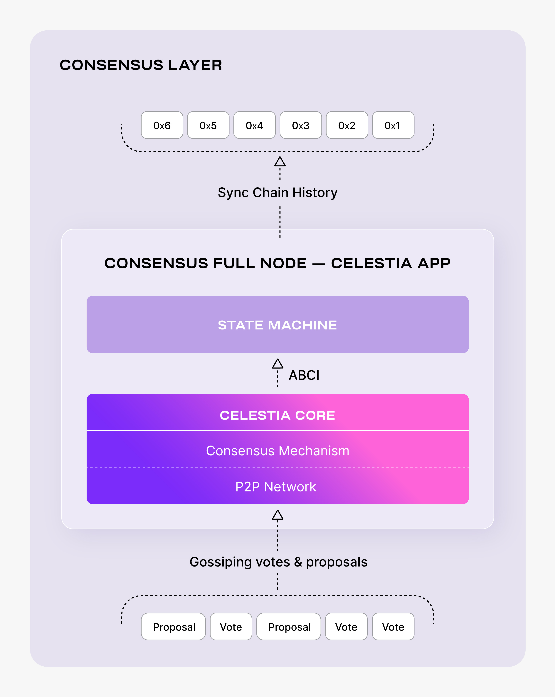

# Setting up a Celestia consensus full node

<!-- markdownlint-disable MD013 -->

Consensus Full Nodes allow you to sync blockchain history in the Celestia
Consensus Layer.



## Hardware requirements

The following hardware minimum requirements are recommended for running the
Consensus Full Node:

* Memory: 8 GB RAM
* CPU: Quad-Core
* Disk: 250 GB SSD Storage
* Bandwidth: 1 Gbps for Download/100 Mbps for Upload

## Setting up your consensus full node

The following tutorial is done on an Ubuntu Linux 20.04 (LTS) x64
instance machine.

### Setup the dependencies

Follow the instructions on installing the dependencies [here](./environment.mdx).

## Deploying the celestia-app

This section describes part 1 of Celestia consensus full node setup:
running a celestia-app daemon with an internal celestia-core node.

> Note: Make sure you have at least 100+ Gb of free space to safely install + run
  the consensus full node.  

### Install celestia-app

Follow the tutorial on installing celestia-app [here](./celestia-app.mdx).

### Setup the P2P networks

Now we will setup the P2P Networks by cloning the networks repository:

```sh
cd $HOME
rm -rf networks
git clone https://github.com/celestiaorg/networks.git
```

To initialize the network pick a "node-name" that describes your
node. The --chain-id parameter we are using here is `mocha`. Keep in
mind that this might change if a new testnet is deployed.

```sh
celestia-appd init "node-name" --chain-id mocha
```

Copy the `genesis.json` file. For mocha we are using:

```sh
cp $HOME/networks/mocha/genesis.json $HOME/.celestia-app/config
```

Set seeds and peers:

<!-- markdownlint-disable MD013 -->
```sh
PERSISTENT_PEERS=$(curl -sL https://raw.githubusercontent.com/celestiaorg/networks/master/mocha/peers.txt | tr -d '\n')
echo $PERSISTENT_PEERS
sed -i.bak -e "s/^persistent_peers *=.*/persistent_peers = \"$PERSISTENT_PEERS\"/" $HOME/.celestia-app/config/config.toml
```
<!-- markdownlint-enable MD013 -->

Note: You can find more peers [here](https://github.com/celestiaorg/networks/blob/master/mocha/peers.txt).

### Configure pruning

For lower disk space usage we recommend setting up pruning using the
configurations below. You can change this to your own pruning configurations
if you want:

```sh
PRUNING="custom"
PRUNING_KEEP_RECENT="100"
PRUNING_INTERVAL="10"

sed -i -e "s/^pruning *=.*/pruning = \"$PRUNING\"/" $HOME/.celestia-app/config/app.toml
sed -i -e "s/^pruning-keep-recent *=.*/pruning-keep-recent = \
\"$PRUNING_KEEP_RECENT\"/" $HOME/.celestia-app/config/app.toml
sed -i -e "s/^pruning-interval *=.*/pruning-interval = \
\"$PRUNING_INTERVAL\"/" $HOME/.celestia-app/config/app.toml
```

### Reset network

This will delete all data folders so we can start fresh:

```sh
celestia-appd tendermint unsafe-reset-all --home $HOME/.celestia-app
```

### Optional: quick-sync with snapshot

Syncing from Genesis can take a long time, depending on your hardware. Using
this method you can synchronize your celestia-node very quickly by downloading
a recent snapshot of the blockchain. If you would like to sync from the Genesis,
then you can skip this part.

Run the following command to quick-sync from a snapshot for `mocha`:

```sh
cd $HOME
rm -rf ~/.celestia-app/data
mkdir -p ~/.celestia-app/data
SNAP_NAME=$(curl -s https://snaps.qubelabs.io/celestia/ | \
    egrep -o ">mocha.*tar" | tr -d ">")
wget -O - https://snaps.qubelabs.io/celestia/${SNAP_NAME} | tar xf - \
    -C ~/.celestia-app/data/
```

### Start the celestia-app

In order to start your consensus full node, run the following:

```sh
celestia-appd start
```

This will let you sync the Celestia blockchain history.

### Optional: configure for RPC endpoint

You can configure your Consensus Full Node to be a public RPC endpoint
and listen to any connections from Data Availability Nodes in order to
serve requests for the Data Availability API [here](../developers/node-tutorial.mdx).

Note that you would need to ensure port 9090 is open for this.

Run the following commands:

<!-- markdownlint-disable MD013 -->
```sh
EXTERNAL_ADDRESS=$(wget -qO- eth0.me)
sed -i.bak -e "s/^external-address = \"\"/external-address = \"$EXTERNAL_ADDRESS:26656\"/" $HOME/.celestia-app/config/config.toml
sed -i 's#"tcp://127.0.0.1:26657"#"tcp://127.0.0.1:26657"#g' ~/.celestia-app/config/config.toml
```
<!-- markdownlint-enable MD013 -->

Restart `celestia-appd` in the previous step to load those configs.

### Start the celestia-app with SystemD

Follow the tutorial on setting up Celestia-App as a background process
with SystemD [here](./systemd.md).

## Transaction indexer configuration options

This section will show you how to set your `config.toml` file in `celestia-app`
to chose which transactions to index. In some
cases, a node operator will be able to decide which transactions to index
based on configuration set in the application.

The options are:

1. `null`
2. `kv` (default) - the simplest possible indexer backed by key-value storage
(defaults to levelDB; see DBBackend)
   1. when `kv` is chosen `tx.height` and `tx.hash` will always be indexed
3. `psql` - the indexer services backed by PostgreSQL
   1. when `kv` or `psql` is chosen, `tx.height` and `tx.hash` will always be indexed
