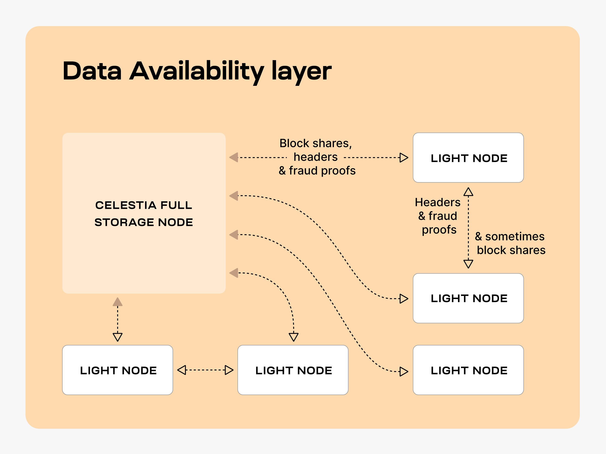

# Setting up a Celestia full storage Node

````mdx-code-block
import Tabs from '@theme/Tabs';
import TabItem from '@theme/TabItem';
````

This tutorial will guide you through setting up a Celestia Full Storage
Node, which is a celestia-node that doesn't connect to celestia-app
(hence not a full node) but stores all the data.

## Overview of full storage nodes

Full Storage nodes are celestia-nodes that store all the data. Full
Storage nodes send block shares, headers, and fraud proofs to Light Nodes.
The Light Nodes gossip headers, fraud proofs, and sometimes block shares, between one another. 



## Hardware requirements

The following hardware minimum requirements are recommended for running
the full storage node:

* Memory: 8 GB RAM
* CPU: Quad-Core
* Disk: 250 GB SSD Storage
* Bandwidth: 1 Gbps for Download/100 Mbps for Upload

## Setting up your full storage node

The following tutorial is done on an Ubuntu Linux 20.04 (LTS) x64 instance machine.

### Setup the dependencies

You can follow the tutorial for setting up your dependencies [here](./environment.mdx)

## Install celestia-node

> Note: Make sure that you have at least 250+ Gb of free space for
  Celestia Full Storage Node

You can follow the tutorial for installing celestia-node [here](./celestia-node.mdx)

### Run the full storage node

#### Initialize the full storage node

Run the following command:

````mdx-code-block
<Tabs groupId="network">
<TabItem value="blockspacerace" label="blockspacerace">

```sh
celestia full init --p2p.network blockspacerace
```

</TabItem>
<TabItem value="mocha" label="Mocha">

```sh 
celestia full init
```

</TabItem>
<TabItem value="arabica" label="Arabica 🏗️">

```sh
celestia full init --p2p.network arabica
```

</TabItem>
</Tabs>
````

#### Start the full storage node

````mdx-code-block
<Tabs groupId="network">
<TabItem value="blockspacerace" label="blockspacerace">

Start the Full Storage Node with a connection to a validator node's gRPC endpoint
(which is usually exposed on port 9090):

> NOTE: In order for access to the ability to get/submit state-related
  information, such as the ability to submit `PayForBlob` transactions,
  or query for the node's account balance, a gRPC endpoint of a validator
  (core) node must be passed as directed below.

A note on ports:

> NOTE: The `--core.ip` gRPC port defaults to 9090, so if you do not specify
  it in the command line, it will default to that port. You can add the port
  after the IP address or use the  `--core.grpc.port` flag to specify another
  port if you prefer.

```sh
celestia full start --core.ip http://<ip-address> --p2p.network blockspacerace
```

If you would like to find example RPC endpoints, check out the list of
resources [here](../blockspace-race).

You can create your key for your node by following the `cel-key` instructions [here](../../developers/celestia-node-key)

Once you start the Full Node, a wallet key will be generated for you.
You will need to fund that address with testnet tokens to pay for
`PayForBlob` transactions.
You can find the address by running the following command:

```sh
./cel-key list --node.type full --keyring-backend test --p2p.network <network>
```

You can get testnet tokens from:

* [Blockspace Race](../blockspace-race)

> NOTE: If you are running a full-storage node for your sovereign
  rollup, it is highly recommended to request Arabica devnet tokens
  as Arabica has the latest changes that can be used to
  test for developing your sovereign rollup. You can still use
  Mocha Testnet as well, it is just mostly used for Validator operations.

</TabItem>
<TabItem value="mocha" label="Mocha">

Start the Full Storage Node with a connection to a validator node's gRPC endpoint
(which is usually exposed on port 9090):

> NOTE: In order for access to the ability to get/submit state-related
  information, such as the ability to submit `PayForData` transactions,
  or query for the node's account balance, a gRPC endpoint of a validator
  (core) node must be passed as directed below.

A note on ports:

> NOTE: The `--core.ip` gRPC port defaults to 9090, so if you do not specify
  it in the command line, it will default to that port. You can add the port
  after the IP address or use the  `--core.grpc.port` flag to specify another
  port if you prefer.

```sh 
celestia full start --core.ip <ip-address>:<port>
```

If you would like to find example RPC endpoints, check out the list of
resources [here](../mocha-testnet#rpc-endpoints).

You can create your key for your node by following the `cel-key` instructions [here](../../developers/celestia-node-key)

Once you start the Full Node, a wallet key will be generated for you.
You will need to fund that address with testnet tokens to pay for
`PayForData` transactions.
You can find the address by running the following command:

```sh
./cel-key list --node.type full --keyring-backend test --p2p.network <network>
```

You can get testnet tokens from:

* [Mocha](../mocha-testnet)

> NOTE: If you are running a full-storage node for your sovereign
  rollup, it is highly recommended to request Arabica devnet tokens
  as Arabica has the latest changes that can be used to
  test for developing your sovereign rollup. You can still use
  Mocha Testnet as well, it is just mostly used for Validator operations.

</TabItem>
<TabItem value="arabica" label="Arabica 🏗️">

Start the Full Storage Node with a connection to a validator node's gRPC endpoint
(which is usually exposed on port 9090):

> NOTE: In order for access to the ability to get/submit state-related
  information, such as the ability to submit `PayForBlob` transactions,
  or query for the node's account balance, a gRPC endpoint of a validator
  (core) node must be passed as directed below.

A note on ports:

> NOTE: The `--core.ip` gRPC port defaults to 9090, so if you do not specify
  it in the command line, it will default to that port. You can add the port
  after the IP address or use the  `--core.grpc.port` flag to specify another
  port if you prefer.

```sh
celestia full start --core.ip http://<ip-address> --p2p.network arabica
```

If you would like to find example RPC endpoints, check out the list of
resources [here](../arabica-devnet#rpc-endpoints).

You can create your key for your node by following the `cel-key` instructions [here](../../developers/celestia-node-key)

Once you start the Full Node, a wallet key will be generated for you.
You will need to fund that address with testnet tokens to pay for
`PayForBlob` transactions.
You can find the address by running the following command:

```sh
./cel-key list --node.type full --keyring-backend test --p2p.network <network>
```

You can get testnet tokens from:

* [Arabica](../arabica-devnet)

> NOTE: If you are running a full-storage node for your sovereign
  rollup, it is highly recommended to request Arabica devnet tokens
  as Arabica has the latest changes that can be used to
  test for developing your sovereign rollup. You can still use
  Mocha Testnet as well, it is just mostly used for Validator operations.

</TabItem>
</Tabs>
````

### Optional: run the full storage node with a custom key

In order to run a full storage node using a custom key:

1. The custom key must exist inside the celestia full storage node directory
   at the correct path (default: `~/.celestia-full/keys/keyring-test`)
2. The name of the custom key must be passed upon `start`, like so:

````mdx-code-block
<Tabs groupId="network">
<TabItem value="blockspacerace" label="blockspacerace">

```sh
celestia full start --core.ip http://<ip-address> --keyring.accname <name-of-custom-key> --p2p.network blockspacerace
```

</TabItem>
<TabItem value="mocha" label="Mocha">

```sh 
celestia full start --core.ip <ip-address> --keyring.accname <name-of-custom-key>
```

</TabItem>
<TabItem value="arabica" label="Arabica 🏗️">

```sh
celestia full start --core.ip http://<ip-address> --keyring.accname <name-of-custom-key> --p2p.network arabica
```

</TabItem>
</Tabs>
````

### Optional: start the full storage node with SystemD

Follow the tutorial on setting up the full storage node as a background
process with SystemD [here](./systemd.md).

With that, you are now running a Celestia Full Storage Node.
