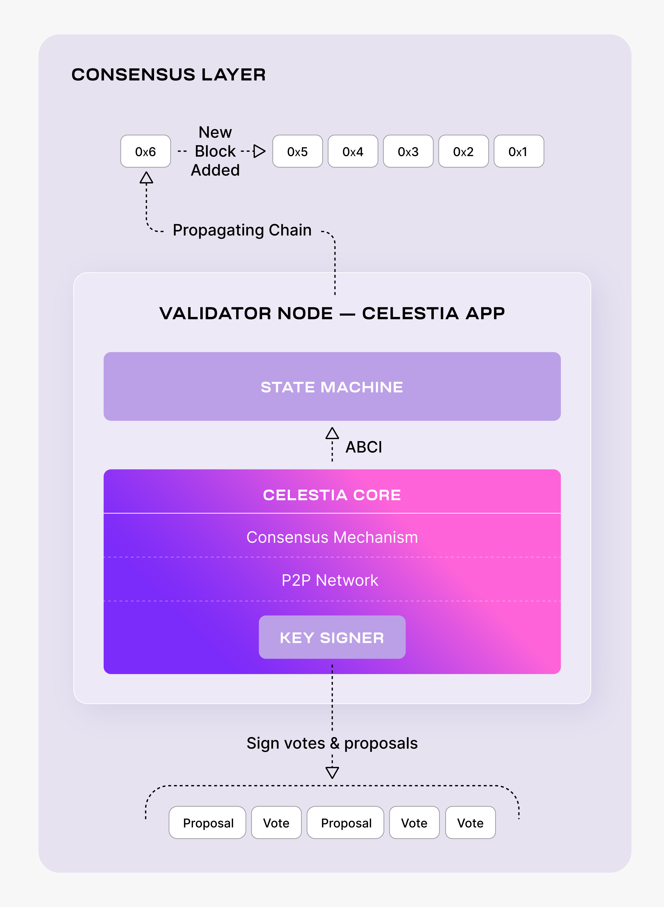

# Setting up a Celestia validator node

Validator nodes allow you to participate in consensus in the Celestia network.



## Hardware requirements

The following hardware minimum requirements are recommended for running the
validator node:

* Memory: 8 GB RAM
* CPU: 6 cores
* Disk: 500 GB SSD Storage
* Bandwidth: 1 Gbps for Download/100 Mbps for Upload

## Setting up your validator node

The following tutorial is done on an Ubuntu Linux 20.04 (LTS) x64
instance machine.

### Setup the dependencies

Follow the instructions on installing the dependencies [here](./environment.mdx).

## Deploying the celestia-app

This section describes part 1 of Celestia Validator Node setup:
running a celestia-app daemon with an internal celestia-core node.

> Note: Make sure you have at least 500+ Gb of free space to safely install+run
  the Validator Node.

### Install celestia-app

Follow the tutorial on installing celestia-app [here](./celestia-app.mdx).

### Setup the P2P networks

Now we will setup the P2P Networks by cloning the networks repository:

```sh
cd $HOME
rm -rf networks
git clone https://github.com/celestiaorg/networks.git
```

To initialize the network pick a "node-name" that describes your
node. The --chain-id parameter we are using here is `mocha`. Keep in
mind that this might change if a new testnet is deployed.

```sh
celestia-appd init "node-name" --chain-id mocha
```

Copy the `genesis.json` file. For mocha we are using:

```sh
cp $HOME/networks/mocha/genesis.json $HOME/.celestia-app/config
```

Set seeds and peers:

<!-- markdownlint-disable MD013 -->
```sh
SEEDS="some seeds"
PEERS="some peers"
sed -i -e 's|^seeds *=.*|seeds = "'$SEEDS'"|; s|^persistent_peers *=.*|persistent_peers = "'$PEERS'"|' $HOME/.celestia-app/config/config.toml
sed -i -e "s/^seed_mode *=.*/seed_mode = \"$SEED_MODE\"/" $HOME/.celestia-app/config/config.toml
```
<!-- markdownlint-enable MD013 -->

Note: You can find more peers [here](https://github.com/celestiaorg/networks/blob/master/mocha/peers.txt).

### Configure pruning

For lower disk space usage we recommend setting up pruning using the
configurations below. You can change this to your own pruning configurations
if you want:

```sh
PRUNING="custom"
PRUNING_KEEP_RECENT="100"
PRUNING_INTERVAL="10"

sed -i -e "s/^pruning *=.*/pruning = \"$PRUNING\"/" $HOME/.celestia-app/config/app.toml
sed -i -e "s/^pruning-keep-recent *=.*/pruning-keep-recent = \
\"$PRUNING_KEEP_RECENT\"/" $HOME/.celestia-app/config/app.toml
sed -i -e "s/^pruning-interval *=.*/pruning-interval = \
\"$PRUNING_INTERVAL\"/" $HOME/.celestia-app/config/app.toml
```

### Optional: quick-sync with snapshot

Syncing from Genesis can take a long time, depending on your hardware. Using
this method you can synchronize your Celestia node very quickly by downloading
a recent snapshot of the blockchain. If you would like to sync from the Genesis,
then you can skip this part.

Run the following command to quick-sync from a snapshot for `mocha`:

```sh
cd $HOME
rm -rf ~/.celestia-app/data
mkdir -p ~/.celestia-app/data
SNAP_NAME=$(curl -s https://snaps.qubelabs.io/celestia/ | \
    egrep -o ">mocha.*tar" | tr -d ">")
wget -O - https://snaps.qubelabs.io/celestia/${SNAP_NAME} | tar xf - \
    -C ~/.celestia-app/data/
```

### Start the celestia-app with SystemD

Follow the tutorial on setting up Celestia-App as a background process
with SystemD [here]( ../systemd).

### Wallet

Follow the tutorial on creating a wallet [here](../developers/celestia-app-wallet.md).

### Delegate stake to a validator

Create an environment variable for the address:

```sh
VALIDATOR_WALLET=<validator-wallet-name>
```

If you want to delegate more stake to any validator, including your own you
will need the `celesvaloper` address of the validator in question. You can
either check it using the block explorer mentioned above or you can run the
command below to get the `celesvaloper` of your local validator wallet in
case you want to delegate more to it:

```sh
celestia-appd keys show $VALIDATOR_WALLET --bech val -a
```

After entering the wallet passphrase you should see a similar output:

```sh
Enter keyring passphrase:
celesvaloper1q3v5cugc8cdpud87u4zwy0a74uxkk6u43cv6hd
```

To delegate tokens to the `celestiavaloper` validator, as an
example you can run:

```sh
celestia-appd tx staking delegate \
    celestiavaloper1q3v5cugc8cdpud87u4zwy0a74uxkk6u4q4gx4p 1000000utia \
    --from=$VALIDATOR_WALLET --chain-id=mocha
```

If successful, you should see a similar output as:

```console
code: 0
codespace: ""
data: ""
gas_used: "0"
gas_wanted: "0"
height: "0"
info: ""
logs: []
raw_log: '[]'
timestamp: ""
tx: null
txhash: <tx-hash>
```

You can check if the TX hash went through using the block explorer by
inputting the `txhash` ID that was returned.

## Deploy the celestia-node

This section describes part 2 of Celestia Validator Node setup: running a
Celestia Bridge Node daemon.

### Install celestia-node

You can follow the tutorial for installing celestia-node [here](./celestia-node.mdx)

### Initialize the bridge node

Run the following:

```sh
celestia bridge init --core.ip <ip-address>
```

> NOTE: The `--core.ip` gRPC port defaults to 9090, so if you do not specify
  it in the command line, it will default to that port. You can add the port
  after the IP address or use the  `--core.grpc.port` flag to specify another
  port if you prefer.

If you need a list of RPC endpoints to connect to, you can check from the list [here](../mocha-testnet#rpc-endpoints)

### Run the bridge node

Run the following:

```sh
celestia bridge start
```

### Optional: start the bridge node with SystemD

Follow the tutorial on setting up the bridge node as a background process with
SystemD [here](../systemd).

You have successfully set up a bridge node that is syncing with the network.

### Setup QGB keys

This step helps get you prepared for when the Quantum Gravity Bridge
is ready to be deployed. You would still need to go through this step
before running a validator to configure 2 extra keys.

* `--evm-address`: This flag should contain a `0x` EVM address. Here,
  you can add any Ethereum-based address to this flag. You can also modify
  it later if you decide to switch addresses.

You can set both the values to the above flags as
environment variables:

```sh
EVM_ADDRESS=<EVM_ADDRESS>
```

Remember to add the values for your addresses in the above
environment variables before setting them.

## Run a validator node

After completing all the necessary steps, you are now ready to run a validator!
In order to create your validator on-chain, follow the instructions below.
Keep in mind that these steps are necessary ONLY if you want to participate
in the consensus.

Pick a `moniker` name of your choice! This is the validator name that will show
up on public dashboards and explorers. `VALIDATOR_WALLET` must be the same you
defined previously. Parameter `--min-self-delegation=1000000` defines the
amount of tokens that are self delegated from your validator wallet.

Now, connect to the network of your choice.

You have the following option of connecting to list of networks shown below:

Continuing the Validator tutorial, here are the steps to connect your
validator to Mocha:

```sh
MONIKER="your_moniker"
VALIDATOR_WALLET="validator"

celestia-appd tx staking create-validator \
    --amount=1000000utia \
    --pubkey=$(celestia-appd tendermint show-validator) \
    --moniker=$MONIKER \
    --chain-id=mocha \
    --commission-rate=0.1 \
    --commission-max-rate=0.2 \
    --commission-max-change-rate=0.01 \
    --min-self-delegation=1000000 \
    --from=$VALIDATOR_WALLET \
    --evm-address=$EVM_ADDRESS \
    --keyring-backend=test
```

You will be prompted to confirm the transaction:

```console
confirm transaction before signing and broadcasting [y/N]: y
```

Inputting `y` should provide an output similar to:

```console
code: 0
codespace: ""
data: ""
gas_used: "0"
gas_wanted: "0"
height: "0"
info: ""
logs: []
raw_log: '[]'
timestamp: ""
tx: null
txhash: <tx-hash>
```

You should now be able to see your validator from a block explorer like [here](https://celestia.explorers.guru)
