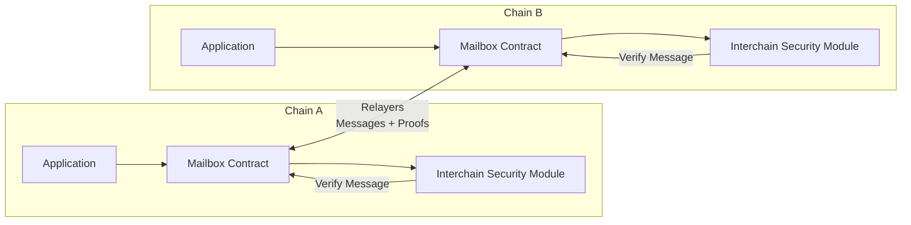

# Using Hyperlane with Celestia

## Live bridge

- [Hyperlane Nexus UI](https://nexus.hyperlane.xyz/?origin=celestia&token=TIA&destination=base)

## Summary

[Hyperlane](https://hyperlane.xyz/) is a permissionless interoperability layer that lets blockchains send messages and trigger actions on one another. Along with [IBC](/learn/features/bridging/ibc), it is one of the standards used on Celestia for cross-chain asset transfers and messages.

You can use Hyperlane to bridge TIA between Celestia and other EVM-compatible chains, as well as send arbitrary cross-chain messages.

## How bridging works

- **Mailbox** — the core contract on each chain that dispatches and processes messages.

- **Relayer** — an off-chain program that delivers messages and metadata between blockchains.

- **Interchain Security Module (ISM)** — a modular security component that verifies messages before they're processed on the destination chain.

**Bridging flow**

1. **Source chain** — the application sends a message to the Mailbox contract, which emits an event and stores a commitment.

2. **Relayer** — an offchain relayer observes the source chain, reads the message event, and fetches the necessary metadata and proofs.

3. **Relayer → destination** — the relayer submits the message plus metadata to the destination Mailbox contract.

4. **Destination chain** — the ISM verifies the message using the provided metadata (proofs, signatures, etc.), and if valid, the Mailbox delivers the message to the recipient application.

5. **Recipient application** — the destination application receives and processes the message (for example, mints tokens, executes a function call, etc.).