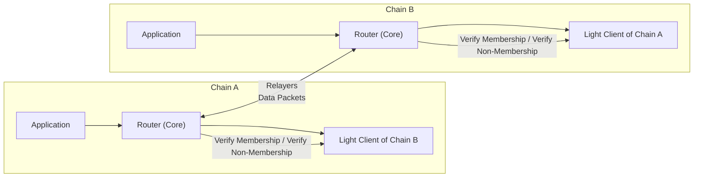

# Using IBC with Celestia

## Live IBC channels

- [Mocha testnet](https://www.mintscan.io/celestia-testnet/relayers/)
- [Mainnet](https://www.mintscan.io/celestia/relayers/)

## Summary
[IBC (Inter-Blockchain Communication)](https://ibcprotocol.dev/) is a protocol for authenticated, permissionless message passing between blockchains. Along with [Hyperlane](/learn/features/bridging/hyperlane), it is one of the standards used on Celestia for cross-chain asset transfers and messages.

You can use IBC to bridge assets between Celestia-native chains along with other chains.

## How bridging works

- **Light client** — a lightweight representation of a destination chain that lives within the state machine of a source chain.

- **Relayer** — an off-chain program that facilitates communication between independent blockchains.

- **Router** — a component in the that connects two blockchains, handles packet routing between applications, and manages the verification of cross-chain data.

**Bridging flow**
1. **Source chain** — the source router (onchain module) escrows or burns the tokens, builds a packet (payload + seq + timeout), and stores a packet commitment (hash) in state.

2. **Relayer** — an offchain relayer observes the source, reads the packet and the packet-commitment, and fetches a proof of that commitment from the source chain.

3. **Relayer → destination** — the relayer submits the packet plus the commitment proof to the destination router.

4. **Destination chain** — the destination’s light client verifies the commitment proof and, if valid, the destination router processes the packet (for example mints or credits) and writes an acknowledgement commitment.

5. **Relayer → Source** — the relayer fetches the acknowledgement and submits the acknowledgement proof back to the source chain.

6. **Source chain** — the source’s light client verifies the acknowledgement proof and the source router finalizes the transfer (releases escrow or marks the packet complete); if the timeout elapsed first, the source router executes refund logic.